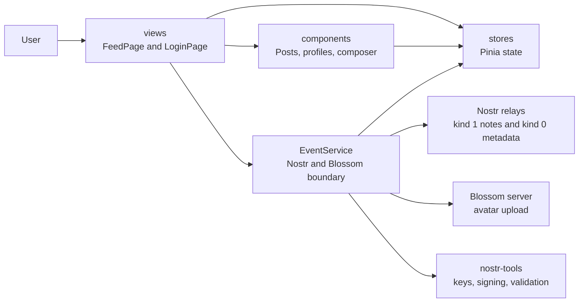
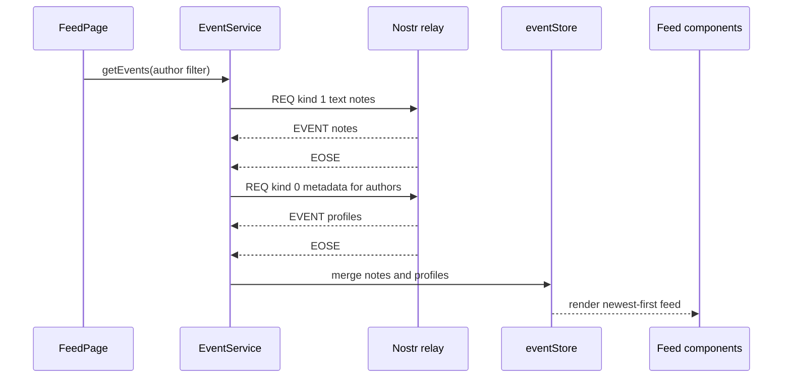
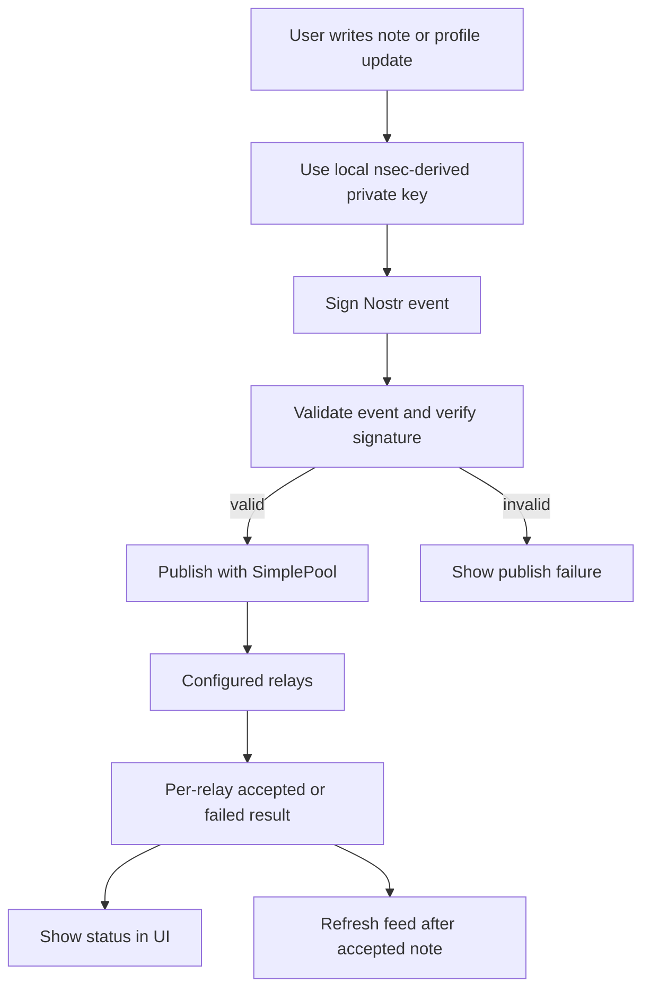

# Avestruz

Avestruz is a lightweight, mobile-first Nostr client for reading public relay
feeds, viewing profiles, and publishing text notes. It is built to keep the
protocol visible: content comes from configured relays, identity is key-based,
and notes are signed locally before publishing.

## Current Features

- Reads kind 1 text notes from configured Nostr relays.
- Loads kind 0 profile metadata for note authors.
- Filters the feed by selected profile.
- Signs in with an existing `nsec` private key or generates a new local key.
- Publishes signed text notes and profile metadata to relays.
- Persists local identity settings with Pinia persisted state.
- Optionally verifies NIP-05 identifiers.
- Uploads profile avatars to a configured Blossom server.
- Renders simple image and video URLs inside note content.

## Tech Stack

- Vue 3 with the Composition API
- Vite and TypeScript
- Pinia and `pinia-plugin-persistedstate`
- Vue Router
- Ionic Vue and Ionicons
- Capacitor
- `nostr-tools`
- Vitest

## Getting Started

Install dependencies:

```sh
npm install
```

Create local environment settings:

```sh
cp .env.template .env
```

Edit `.env` with the relays and services you want to use, then start the app:

```sh
npm run dev
```

Build for production:

```sh
npm run build
```

Run unit tests:

```sh
npm run test:unit
```

## Configuration

The app reads runtime configuration from Vite environment variables.

| Variable | Purpose |
| --- | --- |
| `VITE_RELAYS` | Comma-separated list of Nostr relay WebSocket URLs. |
| `VITE_BLOSSOM_SERVER` | Optional Blossom server base URL for avatar uploads. |
| `VITE_DEFAULT_IMAGE` | Avatar fallback URL prefix. |
| `VITE_SUB_LIMIT` | Relay subscription limit for feed and metadata requests. |
| `VITE_VERIFY_NIP05` | Set to `true` to verify NIP-05 profile identifiers. |

## System Design

Avestruz keeps UI composition, state, and protocol access separated:



- `src/views/` contains page-level coordination. `FeedPage` loads relay data
  for the full feed or selected profile, while `LoginPage` handles key entry,
  generated keys, profile editing, and avatar upload.
- `src/components/` contains UI building blocks such as posts, profiles,
  avatars, media rendering, login controls, and the note composer.
- `src/stores/` contains Pinia state. `eventStore` holds derived feed items,
  `settingsStore` persists local identity and profile state, and `utilStore`
  tracks UI state such as loading and selected profile.
- `src/services/EventService.ts` is the Nostr and Blossom boundary. It reads
  environment configuration, opens relay WebSocket subscriptions, parses profile
  metadata, signs and validates events with `nostr-tools`, publishes to relays,
  verifies NIP-05 identifiers, and uploads avatar files.
- `src/composables/` contains reusable local formatting and text helpers.
- `src/types/` defines shared event, profile, and derived view-model types.

### Relay Read Flow



1. `FeedPage` watches the selected profile.
2. The page calls `EventService.getEvents()` with either no author filter or the
   selected public key.
3. `EventService` opens a WebSocket to each configured relay and sends a Nostr
   `REQ` for kind 1 text notes.
4. After note events finish, the service requests kind 0 metadata for discovered
   authors.
5. Notes and profiles are merged into `textNotesUsers`, sorted newest-first,
   and rendered by the feed components.

### Publish Flow



1. The user signs in with an `nsec` key or generates a new local key.
2. `nostr-tools` derives the public key and signs kind 1 notes or kind 0 profile
   metadata.
3. The signed event is validated and signature-checked before publishing.
4. `SimplePool` publishes the event to configured relays and reports per-relay
   success or failure in the UI.

### Local Identity

Private key material is stored only in local persisted Pinia state for the
current browser/app install. The app never sends private keys to relays or
upload servers; it only sends signed Nostr events and Blossom upload
authorizations derived from the local key.

## Product Direction

Avestruz aims to stay small, inspectable, and protocol-aware. It does not add
hidden ranking, proprietary timelines, or engagement loops. Relay failures,
missing metadata, malformed profile JSON, and partial data should degrade
gracefully instead of blocking the whole feed.
